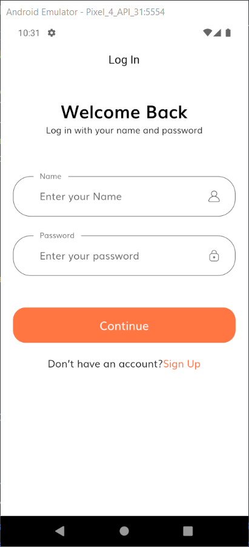
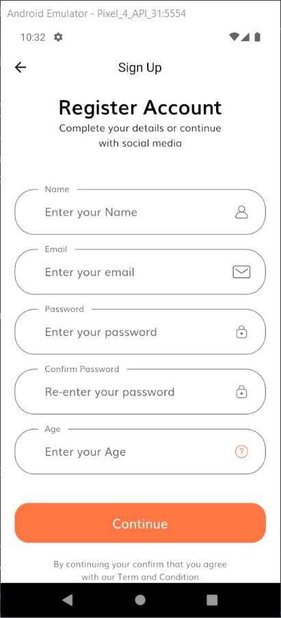
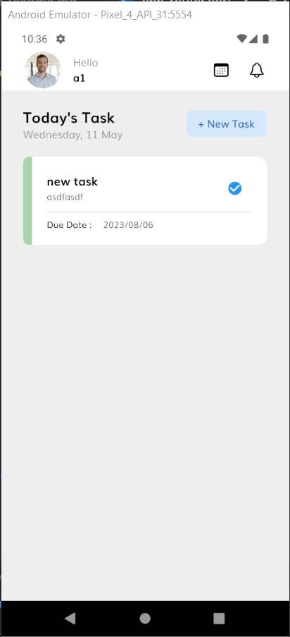
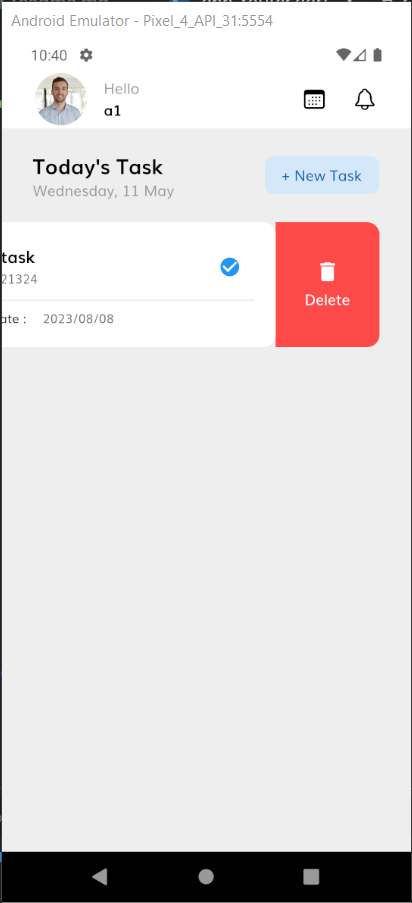
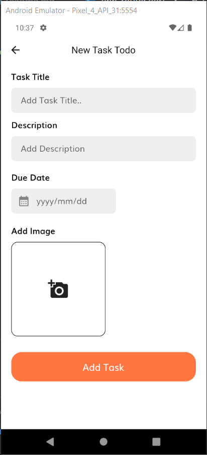
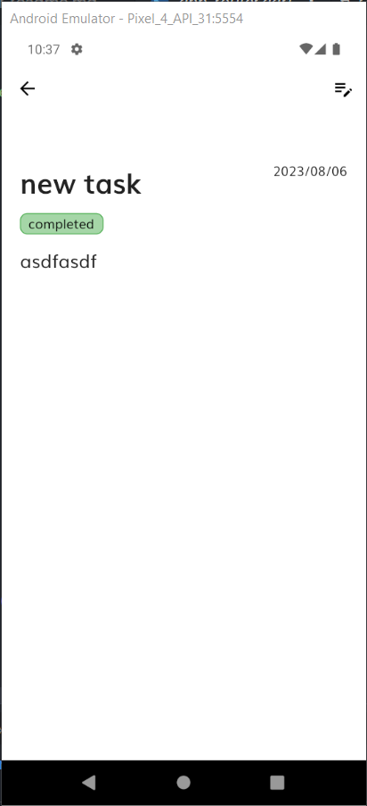
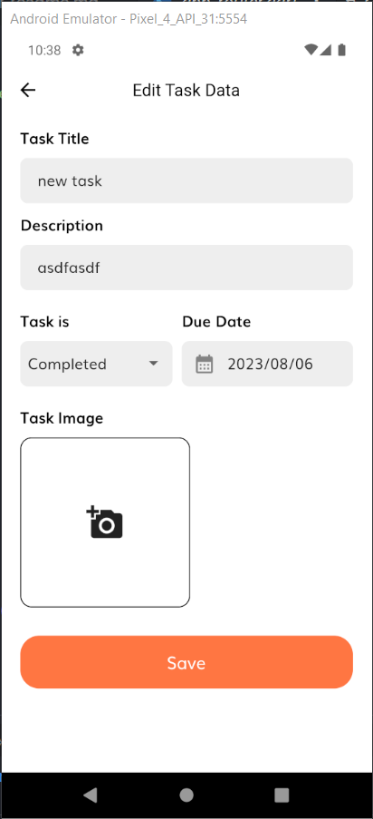

# Flutter Tasker App

Description: Flutter Tasker is a productivity app that helps users manage their tasks and stay organized. It provides features such as user authentication, task tracking, profile management .

### I'm using in this project :
  - Riverpod State Management.
  - Freezed package.
  - Implement CRUD operations with API.
  - Authenticate users using an API.
  - MVVM Architecture Pattern.

### Features:

1. Login Screen:
   - Implement a login screen with email and password fields.
   - Perform form validation to ensure the input is valid.

2. Task Management:
   - Create a screen where users can add, view, and manage their tasks.
   - Include options to add task details like title, description, due date, and priority.
   - Implement CRUD (Create, Read, Update, Delete) functionality for tasks.
   - Display tasks in a list format and allow users to mark tasks as completed.

3. Image Upload:
   - Enable users to upload images related to their tasks.
   - Implement image selection from the device's gallery or camera.
   - Compress and upload images to a server or a cloud storage service.
   - Display the uploaded images within the task details.

4. Profile Management:
   - Design a profile screen where users can view and update their personal information.
   - Fetch user data from an API and display it in the profile view.
   - Allow users to edit their profile details and save changes through API calls.

### Screen Shots :

  - Login Screen :
   
   
  - Register Screen :
 

- Home Screen :
   
 
 

- Add Task Screen :
 

- View Task Screen :
 

- Edit Task Screen :
 
